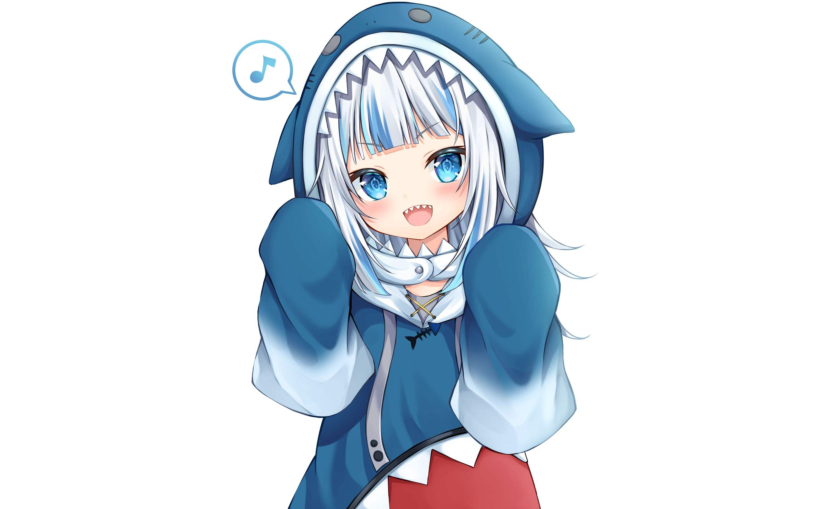
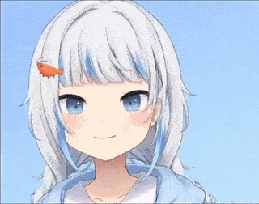
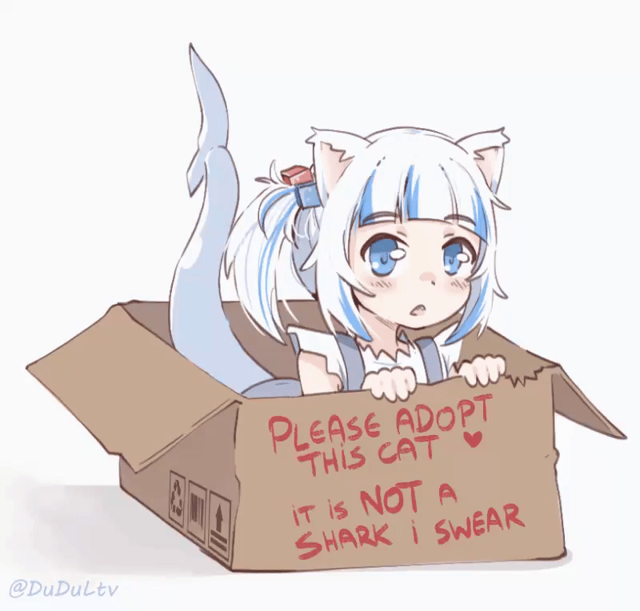
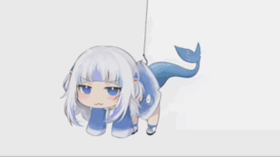
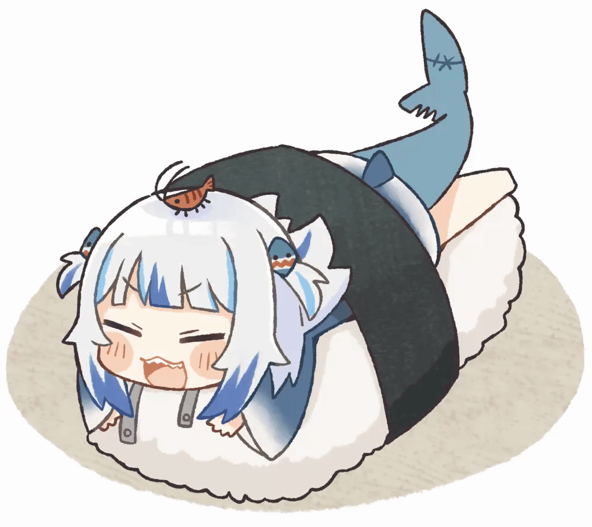
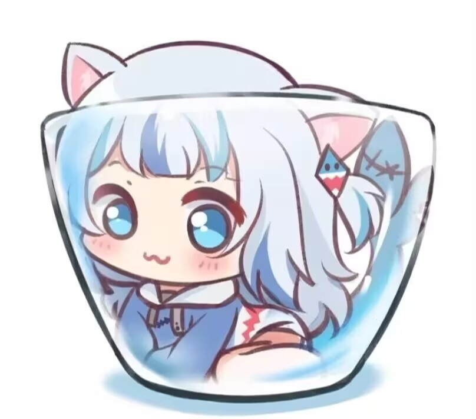
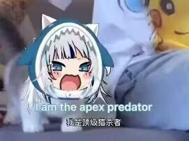
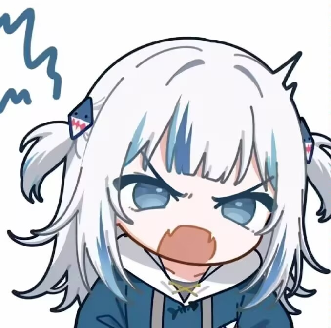
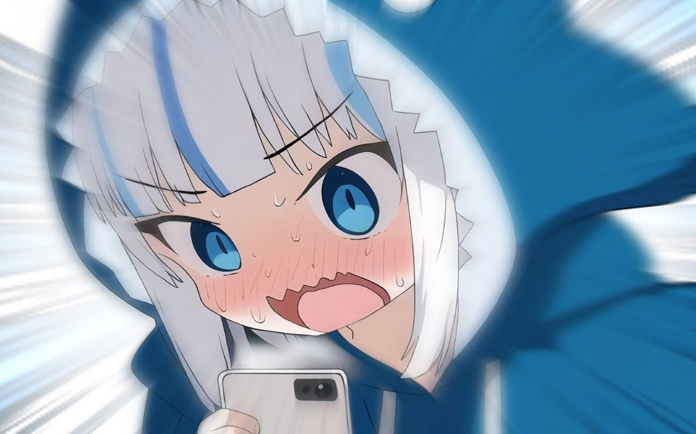
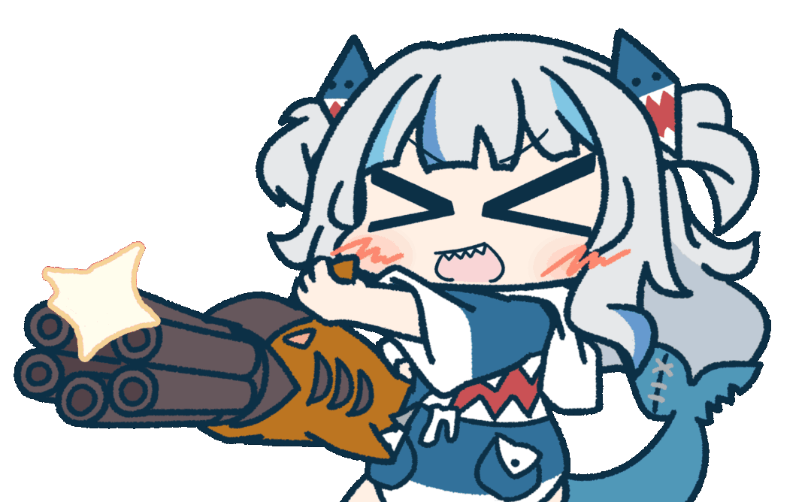

# A！！！我是一只鲨鱼！

  
  
  

 
 

 

<strong>我只是抄过来的没想到有这么多东西啊！</strong>

 

## 亚特兰蒂斯档案

<table>
  <tr>
    <td align="center" width="24%">
      
       
      <strong>浅蓝海域常驻鲨鱼</strong>
    </td>
    <td width="52%">
      

        <strong>身份标签：</strong>
        
        
        
        
      

      
<strong>当前在做什么：</strong>想到什么就做什么awa

      
<strong>想展示的项目：</strong>无

      
<strong>喜欢的关键词：</strong>大白鲨、锤头鲨、鲸鲨、虎鲨、柠檬鲨、护士鲨、长尾鲨、睡鲨、姥鲨、达摩鲨

      
<strong>座右铭：</strong>亚特兰蒂斯最会写代码的鲨鱼！

    </td>
    <td align="center" width="24%">
      
       
      
    </td>
  </tr>
</table>

 

## 深海学籍档案

<table>
  <tr>
    <th>阶段</th>
    <th>学校</th>
    <th>入学理由</th>
    <th>毕业状态</th>
  </tr>
  <tr>
    <td>幼儿园</td>
    <td>海绵宝宝菠萝屋幼儿园</td>
    <td>因为离海很近，适合鲨鲨通勤</td>
    <td>学会了冒头</td>
  </tr>
  <tr>
    <td>小学</td>
    <td>家里蹲第一小学</td>
    <td>主修睡觉与纸箱潜伏</td>
    <td>全勤失败，但很快乐</td>
  </tr>
  <tr>
    <td>初中</td>
    <td>霍格沃兹魔法学院附属水产班</td>
    <td>试图学习把 bug 变没</td>
    <td>魔杖被咬了！！！</td>
  </tr>
  <tr>
    <td>高中</td>
    <td>哥谭市夜间补习学校</td>
    <td>学习如何在深夜写代码</td>
    <td>黑眼圈优秀毕业</td>
  </tr>
  <tr>
    <td>本科</td>
    <td>蓝翔深海挖掘机与 Git 提交学院</td>
    <td>进修把坑挖大再填上的技术</td>
    <td>提交记录开始出现</td>
  </tr>
  <tr>
    <td>研究生</td>
    <td>密斯卡托尼克大学</td>
    <td>研究不可名状的 README 排版</td>
    <td>精神稳定，页面不一定稳定</td>
  </tr>
  <tr>
    <td>博士生</td>
    <td>亚特兰蒂斯国立大学</td>
    <td>研究亚特兰蒂斯最会写代码的鲨鱼为什么会写代码</td>
    <td>论文题目还在水里泡着</td>
  </tr>
</table>

 

 

## 摸摸许可证

摸头可以，戳一下会应激，不许抓尾巴！

 
 

 

## 挂鲨公告

 

被挂起来了，但还在营业。

 

## 海底

 
 

<table>
  <tr>
    <td align="center">
      <strong>数据面板</strong>
       
      
    </td>
    <td align="center">
      <strong>代码结构</strong>
       
      
    </td>
  </tr>
</table>

 

## 投喂渠道

<strong>好麻烦……暂时没有啦！</strong>

 

## 目前掌握的技能

<table>
  <tr>
    <th>能力领域</th>
    <th>掌握情况</th>
    <th>正式说明</th>
  </tr>
  <tr>
    <td>环境适应与快速响应</td>
    <td>稳定发挥</td>
    <td>能够在纸箱、杯子、深海等多种场景中迅速完成露面与状态切换。</td>
  </tr>
  <tr>
    <td>动态展示与节奏控制</td>
    <td>持续训练</td>
    <td>具备转圈、摇晃、起舞等多种可视化表达能力，适用于提升页面活跃度。</td>
  </tr>
  <tr>
    <td>交互接收与情绪反馈</td>
    <td>条件触发</td>
    <td>在摸头、投喂、围观等交互下，可输出无辜、乖巧或应激等反馈状态。</td>
  </tr>
  <tr>
    <td>异常处理与风险规避</td>
    <td>自动执行</td>
    <td>遇到 bug 或突发戳戳时，会优先进入装傻、祈祷与继续尝试流程。</td>
  </tr>
  <tr>
    <td>深海巡航与长期学习</td>
    <td>长期进行</td>
    <td>以“想到什么就做什么”为基本原则，持续探索新的鲨鱼。</td>
  </tr>
</table>

 

 

## 顶级猎杀者

 

## 深海留言板

<strong>这里没有项目，只有鲨鱼。</strong>

今日状态：想到什么就做什么awa。

 

### *「亚特兰蒂斯最会写代码的鲨鱼！」*

